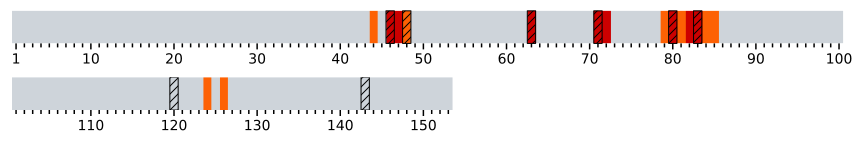
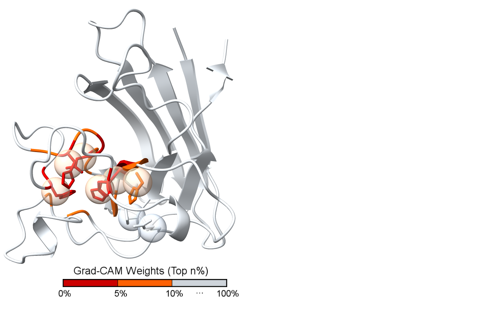

## EC-Graph
Enzyme function prediction with GCN-based deep learning framework 


## Dependencies
EC-Graph is based on python 3.8.12 and PyTorch-1.8.0

The required dependencies are in:
```
pip install -r requirements.txt
```


## Pretrained models

Pretrained models are available here:
[Models](https://drive.google.com/file/d/1YOQlELaQNxd1HHWCXx_sEDKo7Fo1l7te/view?usp=sharing)

1. Uncompress the model.tar.gz 
2. Move the models to the /models/ directory


## EC number prediction and catalytic site prediction
Download the target PDB structures (.pdb) and place it in folder 'data'
```
python predict.py
```


## Catalytic site prediction
The model-predicted catalytic residues can be found here. Based on the protein amino acid length, we highlight the top 10% residues as model-predicted catalytic residues and illustrate the results with M-CSA dataset/UniProtKB database.
* Red: Top 5%
* Orange: Top 5%-10%

### Example PDB [2JCW_A](https://www.rcsb.org/structure/2jcw)

Prediction by amino acid positions: 2JCW_A.svg


Prediction by structural illustration: 2JCW_A.cxc
* Can be visualized via the [UCSF ChimeraX software](https://www.cgl.ucsf.edu/chimerax/)



* This cxc files can be downloaded at /figures/2JCW_A_mcsa.cxc


## Predictions of AlphaFold-2-predicted structures
Prediction of AlphaFold-2-predicted structures can be downloaded from:

Catalytic sites prediction of AF structures.
* TP Cases: EC-Graph predictions match existing UniProt Annotations
* FP Cases: These are proposed EC annotations by EC-Graph

| Type | Species | TP Cases | FP Cases |
| --- | --- | --- | --- |
| Model Organism Proteomes | Arabidopsis thaliana (arath) | [arath_tp](https://drive.google.com/file/d/1Sp2n9hhEHJ_t3cHdATUG5jGr2XEoru6B/view?usp=sharing) | [arath_fp](https://drive.google.com/file/d/1R0f-DTKQHgGDNlRzFphFH_WPfLacCUSq/view?usp=sharing) |
| Model Organism Proteomes | Caenorhabditis elegans (caeel) | [caeel_tp](https://drive.google.com/file/d/1R6aokA3P5aB9o2lhTyyfMd11ipyZcagz/view?usp=sharing) | [caeel_fp](https://drive.google.com/file/d/1Q5FBP-ThSEMQ9sqXrP8pKTdym3Gw5N1u/view?usp=sharing) |
| Model Organism Proteomes | Candida albicans (canal) | [canal_tp](https://drive.google.com/file/d/1R03E6M092uKAKlAcQ3e1DXij_s0foxRc/view?usp=sharing) | [canal_fp](https://drive.google.com/file/d/1PzRTT4TQt_QAwoScAnAnflt7bQG56hcj/view?usp=sharing) |
| Model Organism Proteomes | Danio rerio (danre) | [danre_tp](https://drive.google.com/file/d/1QsqJiLZTTdM1Q0m_-vb1rIg8EvGY8HJW/view?usp=sharing) | [danre_fp](https://drive.google.com/file/d/1SiNsB1ztXLw1aRk7_oEIUwmA9n8qUTwp/view?usp=sharing) |
| Model Organism Proteomes | Dictyostelium discoideum (dicdi) | [dicdi_tp](https://drive.google.com/file/d/1QxPnb4NXgq5hEPph5_OdZchDPXAtHGnF/view?usp=sharing) | [dicdi_fp](https://drive.google.com/file/d/1SfA_q-zlC3OC0NRewN-M1t6LMIYOZhmh/view?usp=sharing) |
| Model Organism Proteomes | Drosophila melanogaster (drome) | [drome_tp](https://drive.google.com/file/d/1RHmto3CdlhCdWL4402JcoOZokYqVgD49/view?usp=sharing) | [drome_fp](https://drive.google.com/file/d/1QwWvWYk0MsW9xSJyEsm02bvMT8TLSBH_/view?usp=sharing) |
| Model Organism Proteomes | Escherichia coli (ecoli) | [ecoli_tp](https://drive.google.com/file/d/1QolcnmQsIjJKFMfpqzGffqVeNFlUbxMx/view?usp=sharing) | [ecoli_fp](https://drive.google.com/file/d/1QlTYclLuy9WJb3-UpKAm3LxtGNzbFofr/view?usp=sharing) |
| Model Organism Proteomes | Glycine max (soybn) | [soybn_tp](https://drive.google.com/file/d/1R-k0tkL4TJmWi8wWziqlvFksqsnadLFG/view?usp=sharing) | [soybn_fp](https://drive.google.com/file/d/1PVN0Yxm1BPJR7lvJWZjzvA8rkeffg7ld/view?usp=sharing) |
| Model Organism Proteomes | Homo sapiens (human) | [human_tp](https://drive.google.com/file/d/1PSEXFPr0TU-yBvAtFfcnMyDe-lRVaPXx/view?usp=sharing) | [human_fp](https://drive.google.com/file/d/1Q1ueD5QMynVlnYI3h1WBfrE7jj2JLIRL/view?usp=sharing) |
| Model Organism Proteomes | Methanocaldococcus jannaschii (metja) | [metja_tp](https://drive.google.com/file/d/1R6zBrMfuUfC4qHK8Ej552hMseUmptfz3/view?usp=sharing) | [metja_fp](https://drive.google.com/file/d/1SZng8uY5ChStXbcMZ65JrW9H0I3A12EQ/view?usp=sharing) |
| Model Organism Proteomes | Mus musculus (mouse) | [mouse_tp](https://drive.google.com/file/d/1RRkRKReNiqvDZnf6Z6DBgMAYpCzALFYb/view?usp=sharing) | [mouse_fp](https://drive.google.com/file/d/1Pvjov4AwHEvoDn8-VU_UPLtMyxoDUlgD/view?usp=sharing) |
| Model Organism Proteomes | Oryza sativa (orysj) | [orysj_tp](https://drive.google.com/file/d/1SbU8lUFvjzYmDAapAq90wRJxIAlTPCkJ/view?usp=sharing) | [orysj_fp](https://drive.google.com/file/d/1SYvVfdtxaRWra5siCqOJColPPd-k9qd5/view?usp=sharing) |
| Model Organism Proteomes | Rattus norvegicus (rat) | [rat_tp](https://drive.google.com/file/d/1PTkk8rMpvmskBpOElpMmiTz0mdmcP78N/view?usp=sharing) | [rat_fp](https://drive.google.com/file/d/1R8AlHMX1jKPGk5icTnsxBqMHjkONaQIs/view?usp=sharing) |
| Model Organism Proteomes | Saccharomyces cerevisiae (yeast) | [yeast_tp](https://drive.google.com/file/d/1QepL3k0NB64o15cabgn9X65eY-ZRPs9r/view?usp=sharing) | [yeast_fp](https://drive.google.com/file/d/1QPekeGXKUYZGCPcXSUQXdkx2M4QRWNGM/view?usp=sharing) |
| Model Organism Proteomes | Schizosaccharomyces pombe (schpo) | [schpo_tp](https://drive.google.com/file/d/1R2zbg7U8Bo62NKqGO9vmjuHAV4568kDY/view?usp=sharing) | [schpo_fp](https://drive.google.com/file/d/1PWSP9acvYkOpiHXvwLJ1r3pT4Q5oH2mM/view?usp=sharing) |
| Model Organism Proteomes | Zea mays (maize) | [maize_tp](https://drive.google.com/file/d/1S8mGsm03THDLfTDcUkrSHnrcTEZawrmn/view?usp=sharing) | [maize_fp](https://drive.google.com/file/d/1R7SXwoL-f1-xdV2GDhY5pOdRlwkk9tpz/view?usp=sharing) |
| Global Health Proteomes | Ajellomyces capsulatus (ajecg) | [ajecg_tp](https://drive.google.com/file/d/1S7NlCT53nxuZEe15GH19WG4y3YG1slRb/view?usp=sharing) | [ajecg_fp](https://drive.google.com/file/d/1QSE__wJRGu3aJ5t_J3MYzKUj0aVZC4-N/view?usp=sharing) |
| Global Health Proteomes | Brugia malayi (bruma) | [bruma_tp](https://drive.google.com/file/d/1S0MCePQ-oAzsSyU9BAGNPwA6KIdHq1Ox/view?usp=sharing) | [bruma_fp](https://drive.google.com/file/d/1Pj-iKRdiEnNg6wxF9gEftz-7ysDmNyfM/view?usp=sharing) |
| Global Health Proteomes | Campylobacter jejuni (camje) | [camje_tp](https://drive.google.com/file/d/1PzRTT4TQt_QAwoScAnAnflt7bQG56hcj/view?usp=sharing) | [camje_fp](https://drive.google.com/file/d/1PzRTT4TQt_QAwoScAnAnflt7bQG56hcj/view?usp=sharing) |
| Global Health Proteomes | Cladophialophora carrionii (9euro1) | [9euro1_tp](https://drive.google.com/file/d/1RRqgqdMm_C6n_ueyZYXftt3-TyHT0_7T/view?usp=sharing) | [9euro1_fp](https://drive.google.com/file/d/1T-W8LxgsE5qsx2aCZJ0gv0Y4XuAZOQrb/view?usp=sharing) |
| Global Health Proteomes | Dracunculus medinensis (drame) | [drame_tp](https://drive.google.com/file/d/1SsFh8XfK5Jj8s8IKmRBYjSIQvW2hvYbN/view?usp=sharing) | [drame_fp](https://drive.google.com/file/d/1QL-EEuh27khaI41lNAqqfZ-4--vETENJ/view?usp=sharing) |
| Global Health Proteomes | Enterococcus faecium (entfc) | [entfc_tp](https://drive.google.com/file/d/1SBUEElCG_wCxA5cIz-0z_9iFWMLBQ0Kj/view?usp=sharing) | [entfc_fp](https://drive.google.com/file/d/1SByDIV4T54u1_auoQavMsBhbo4RcW2kF/view?usp=sharing) |
| Global Health Proteomes | Fonsecaea pedrosoi (9euro2) | [9euro2_tp](https://drive.google.com/file/d/1SXPwMd9iy6cve4hI4dB7FDTL7g00aTS3/view?usp=sharing) | [9euro2_fp](https://drive.google.com/file/d/1Sg_TQa-pHG1IgyPZgZ9Mpq8KYYQEjZmc/view?usp=sharing) |
| Global Health Proteomes | Haemophilus influenzae (haein) | [haein_tp](https://drive.google.com/file/d/1Q1iHI5saCpyyIKDhaTz0ZRyQ2CnyuqHK/view?usp=sharing) | [haein_fp](https://drive.google.com/file/d/1RWqhmmV-Z1dfd8b9Wiu_9VNOLt8nZIyr/view?usp=sharing) |
| Global Health Proteomes | Helicobacter pylori (helpy) | [helpy_tp](https://drive.google.com/file/d/1SB9_xROJA_FDp0V_t11tFbolzv4W0pPC/view?usp=sharing) | [helpy_fp](https://drive.google.com/file/d/1RmYE-yj40NuoudvvmtFarc5IdUU6zaQf/view?usp=sharing) |
| Global Health Proteomes | Klebsiella pneumoniae (kleph) | [kleph_tp](https://drive.google.com/file/d/1RE5X_g20iNl0dHffCBBZ8JKYT7PjloaY/view?usp=sharing) | [kleph_fp](https://drive.google.com/file/d/1Q7C-YJEV2s1TldVl9BAVeWyzv1KiTaHY/view?usp=sharing) |
| Global Health Proteomes | Leishmania infantum (leiin) | [leiin_tp](https://drive.google.com/file/d/1RhSrFljrUuympP26ZGIxwS-xqhEQLnV_/view?usp=sharing) | [leiin_fp](https://drive.google.com/file/d/1SThng1WGZku38HaVe296mLXntBUvrT47/view?usp=sharing) |
| Global Health Proteomes | Madurella mycetomatis (9pezi1) | [9pezi1_tp](https://drive.google.com/file/d/1R4ChBCUeQwGk3jsKtq1lsqZUXzBMZqee/view?usp=sharing) | [9pezi1_fp](https://drive.google.com/file/d/1Qoa8VL01TjZwwRRYpXwF8BJc_y5M61aZ/view?usp=sharing) |
| Global Health Proteomes | Mycobacterium leprae (mycle) | [mycle_tp](https://drive.google.com/file/d/1RvL5Nx62Plgwn43szD02gpAGgHM8OzZp/view?usp=sharing) | [mycle_fp](https://drive.google.com/file/d/1RMNb07r1dqTi3q9mESuqux8OSgvsqCZ2/view?usp=sharing) |
| Global Health Proteomes | Mycobacterium tuberculosis (myctu) | [myctu_tp](https://drive.google.com/file/d/1Qwavj2EN72FFIq4L5zdRkPitvCTVZgl6/view?usp=sharing) | [myctu_fp](https://drive.google.com/file/d/1RgzxHhaW3aLYxoJW0rkC09lbuYHD-5pU/view?usp=sharing) |
| Global Health Proteomes | Mycobacterium ulcerans (mycul) | [mycul_tp](https://drive.google.com/file/d/1RZzXs51ItyQPqcyM0Z2WI9LcU9337qzf/view?usp=sharing) | [mycul_fp](https://drive.google.com/file/d/1Qwavj2EN72FFIq4L5zdRkPitvCTVZgl6/view?usp=sharing) |
| Global Health Proteomes | Neisseria gonorrhoeae (neig1) | [neig1_tp](https://drive.google.com/file/d/1QuEHq7mHx5kqzq8vehvqpjnhkHnxFje4/view?usp=sharing) | [neig1_fp](https://drive.google.com/file/d/1PgasmMbVN2stVYXYOjnxz7z7CIkaJzub/view?usp=sharing) |
| Global Health Proteomes | Nocardia brasiliensis (9noca1) | [9noca1_tp](https://drive.google.com/file/d/1SKu3d9xyzEz0RzOwDcms8rNmCGF1bjHN/view?usp=sharing) | [9noca1_fp](https://drive.google.com/file/d/1QL5BGDowIiL7VUs5H-2Icz_n8Ore6HP0/view?usp=sharing) |
| Global Health Proteomes | Onchocerca volvulus (oncvo) | [oncvo_tp](https://drive.google.com/file/d/1QBmYj0926q0yDSuQvLcLxYNo72HWq4XJ/view?usp=sharing) | [oncvo_fp](https://drive.google.com/file/d/1PXi4e0Lz_kPdRLNIIuHmsp7LGCABkW2Q/view?usp=sharing) |
| Global Health Proteomes | Paracoccidioides lutzii (parba) | [parba_tp](https://drive.google.com/file/d/1PV4F-fCeNwdD2bYqVTE_6wUd84ZKPmol/view?usp=sharing) | [parba_fp](https://drive.google.com/file/d/1T0fRK7X3pyGZlsZvewF6JKwcjgkH6zLd/view?usp=sharing) |
| Global Health Proteomes | Plasmodium falciparum (plaf7) | [plaf7_tp](https://drive.google.com/file/d/1R45xvyTaDtIUVMTb5QLGeu_21TWNhTrs/view?usp=sharing) | [plaf7_fp](https://drive.google.com/file/d/1RRrs2Cq734LNBJdBhEKdjhrhDvSiYQjx/view?usp=sharing) |
| Global Health Proteomes | Pseudomonas aeruginosa (pseae) | [pseae_tp](https://drive.google.com/file/d/1SRpWa1MdoQF-iVg2k1FGMpe0I2nFfS0D/view?usp=sharing) | [pseae_fp](https://drive.google.com/file/d/1P_PrvfhydpmSbCOUgnPfuPC39POwEeOI/view?usp=sharing) |
| Global Health Proteomes | Salmonella typhimurium (salty) | [salty_tp](https://drive.google.com/file/d/1Sskan7uoZ5yM4Mh-tKwBULkcZyQMhVcU/view?usp=sharing) | [salty_fp](https://drive.google.com/file/d/1Qu2H5Lm2hXZ68Twucco94COAVK14ROg8/view?usp=sharing) |
| Global Health Proteomes | Schistosoma mansoni (schma) | [schma_tp](https://drive.google.com/file/d/1RNZYhW7OJ8BeEzNhBTaADF3lPdENoCxh/view?usp=sharing) | [schma_fp](https://drive.google.com/file/d/1Su4bXNQ3lau1iqMFcUGcQTBVF2GE3Vey/view?usp=sharing) |
| Global Health Proteomes | Shigella dysenteriae (shids) | [shids_tp](https://drive.google.com/file/d/1R6jMOWRxRZ2ge5XYZXq_pr__Fo_g-R9z/view?usp=sharing) | [shids_fp](https://drive.google.com/file/d/1Rqf-ZlNNw219LC9M30z2gxiISYcG9Mlj/view?usp=sharing) |
| Global Health Proteomes | Sporothrix schenckii (spos1) | [spos1_tp](https://drive.google.com/file/d/1Q5IMTgCzLHCvVx78qk47MWEYr748wzmO/view?usp=sharing) | [spos1_fp](https://drive.google.com/file/d/1R6Bd__fci3iY1enesgV6HHxMOL55_v1c/view?usp=sharing) |
| Global Health Proteomes | Staphylococcus aureus (staa8) | [staa8_tp](https://drive.google.com/file/d/1QstlMBFHJmbN5vtEzrl3035uFr7gUFZh/view?usp=sharing) | [staa8_fp](https://drive.google.com/file/d/1S9rvZel7Cuf3zucBLVceWjtem5zKhhWw/view?usp=sharing) |
| Global Health Proteomes | Streptococcus pneumoniae (strr6) | [strr6_tp](https://drive.google.com/file/d/1QU3FkTt2twIwqPKmtgekM48IizoQcT8n/view?usp=sharing) | [strr6_fp](https://drive.google.com/file/d/1RHf62FwaLhPGU0_E1nLcbwfHIGVBPXPY/view?usp=sharing) |
| Global Health Proteomes | Strongyloides stercoralis (strer) | [strer_tp](https://drive.google.com/file/d/1RPDJ98MRMqqEhBA3Ha3H_rEpF3qOfZZh/view?usp=sharing) | [strer_fp](https://drive.google.com/file/d/1QLChSBiYa-2R9NO7fpCPA5sag-kHPUYl/view?usp=sharing) |
| Global Health Proteomes | Trichuris trichiura (tritr) | [tritr_tp](https://drive.google.com/file/d/1SBiUjZgEth7YAE4treOvZeHetNIH0fcK/view?usp=sharing) | [tritr_fp](https://drive.google.com/file/d/1SsfppxriaawtQjEOA2KDMA4oSBAkFJce/view?usp=sharing) |
| Global Health Proteomes | Trypanosoma brucei (tryb2) | [tryb2_tp](https://drive.google.com/file/d/1SPbkKR7UJwmmRZPyyryaTYgoJVcGHPcS/view?usp=sharing) | [tryb2_fp](https://drive.google.com/file/d/1RE6qXTnIRS6kiODEfM6GkNv11wzQrb9v/view?usp=sharing) |
| Global Health Proteomes | Trypanosoma cruzi (trycc) | [trycc_tp](https://drive.google.com/file/d/1SD7koIeeIZhs4366UZmn-a3A5_rSk8LJ/view?usp=sharing) | [trycc_fp](https://drive.google.com/file/d/1Sk9dA4R3ZesBD5W1SCW6_9hFcUKWNq8T/view?usp=sharing) |
| Global Health Proteomes | Wuchereria bancrofti (wucba) | [wucba_tp](https://drive.google.com/file/d/1Pziuc3C8wKVbrcYQeoPGgT6jhxps6qEO/view?usp=sharing) | [wucba_fp](https://drive.google.com/file/d/1QmsJcMwfWaxPCK8YfyNAcYf_oHdPFlAm/view?usp=sharing) |
| Swiss-Prot | Swiss-Prot Batch 0 (swissprot_s0) | [swissprot_s0_tp](https://drive.google.com/file/d/1RhtcvXCvfHaWmg6-AQgo3kzB_ow4zjxh/view?usp=sharing) | [swissprot_s0_fp](https://drive.google.com/file/d/1QU3FkTt2twIwqPKmtgekM48IizoQcT8n/view?usp=sharing) |
| Swiss-Prot | Swiss-Prot Batch 1 (swissprot_s1) | [swissprot_s1_tp](https://drive.google.com/file/d/1PqCFKsmm1O2vkOmHROx312AdEfT41kaD/view?usp=sharing) | [swissprot_s1_fp](https://drive.google.com/file/d/1SGYxsojWHS8nkKXvtn1-otvkw9O1NRmE/view?usp=sharing) |
| Swiss-Prot | Swiss-Prot Batch 2 (swissprot_s2) | [swissprot_s2_tp](https://drive.google.com/file/d/1PgEkCD_vIc5IKYAxpjISdqkVp9tM0iit/view?usp=sharing) | [swissprot_s2_fp](https://drive.google.com/file/d/1Ryus6bL5fmQGQ_-6zgapkICQyGChZMLY/view?usp=sharing) |
| Swiss-Prot | Swiss-Prot Batch 3 (swissprot_s3) | [swissprot_s3_tp](https://drive.google.com/file/d/1SaO4MsrX6wEXk62KU3dCmMq-5eW_Tylp/view?usp=sharing) | [swissprot_s3_fp](https://drive.google.com/file/d/1Sv5Z96Bctab3HYvgNatNhTQ-IZpjd0Xd/view?usp=sharing) |
| Swiss-Prot | Swiss-Prot Batch 4 (swissprot_s4) | [swissprot_s4_tp](https://drive.google.com/file/d/1S3yeyijejfA5lVLVfiMgSbNpiawEFLbE/view?usp=sharing) | [swissprot_s4_fp](https://drive.google.com/file/d/1PnGcwTIsfuq8br0fYkDSMs1-xX2RRhm5/view?usp=sharing) |

We are currently developing a website interface for visualization of the EC sub-subclass prediction and catalytic sites prediction results. Please stay tuned.

